# IAM Basics Lab - Solution

**Student Name:** Julio Cesar Aldana Almanza  
**Date Completed:** 07/08/2026

---

## Exercise 1: IAM Groups

### Screenshots:
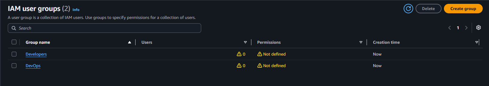

### Groups Created:
- [x] Developers group
- [x] DevOps group

---

## Exercise 2: Group Permissions

### Developers Group:
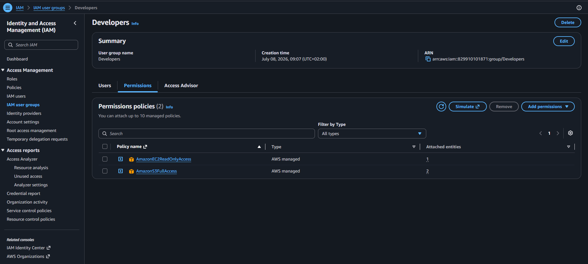

**Policies Attached:**
- AmazonS3FullAccess
- AmazonEC2ReadOnlyAccess

### DevOps Group:
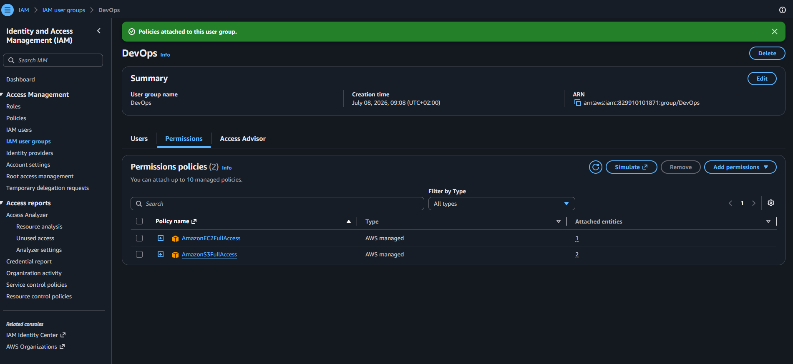

**Policies Attached:**
- AmazonS3FullAccess
- AmazonEC2FullAccess

---

## Exercise 3: IAM Users

### Screenshots:
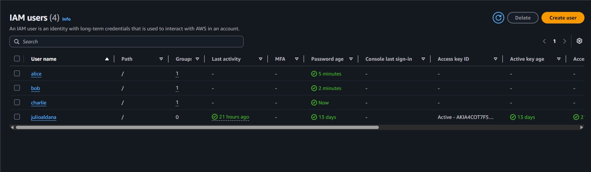

### Users Created:

| Username | Group | Console Access | Status |
|----------|-------|----------------|--------|
| alice | Developers | Yes | ✅ Created |
| bob | Developers | Yes | ✅ Created |
| charlie | DevOps | Yes | ✅ Created |

---

## Exercise 4: Permission Testing

### Alice's Access Tests:

**S3 Access:**
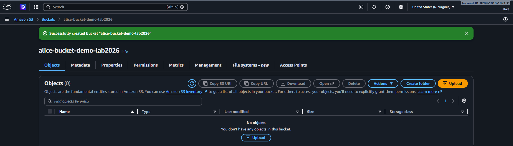
- Create bucket: ✅ SUCCESS
- Upload file: ✅ SUCCESS

**EC2 Access:**
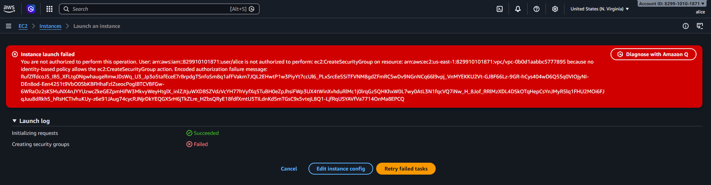
- View instances: ✅ SUCCESS
- Launch instance: ❌ DENIED (Expected)

### Bob's Access Tests:

**S3 Access:**
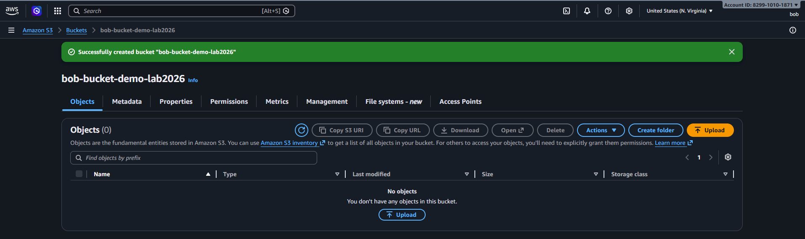
- Create bucket: ✅ SUCCESS

**EC2 Access:**
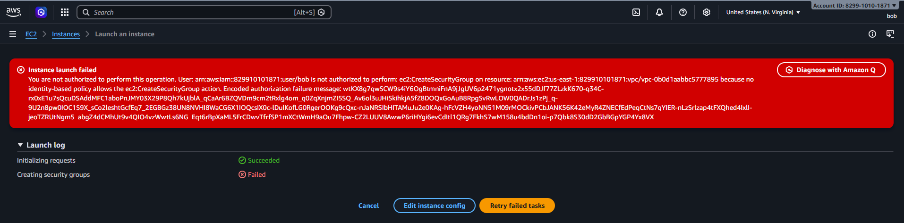
- View instances: ✅ SUCCESS
- Launch instance: ❌ DENIED (Expected)

### Charlie's Access Tests:

**Full Access:**
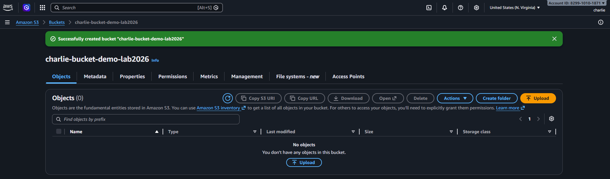
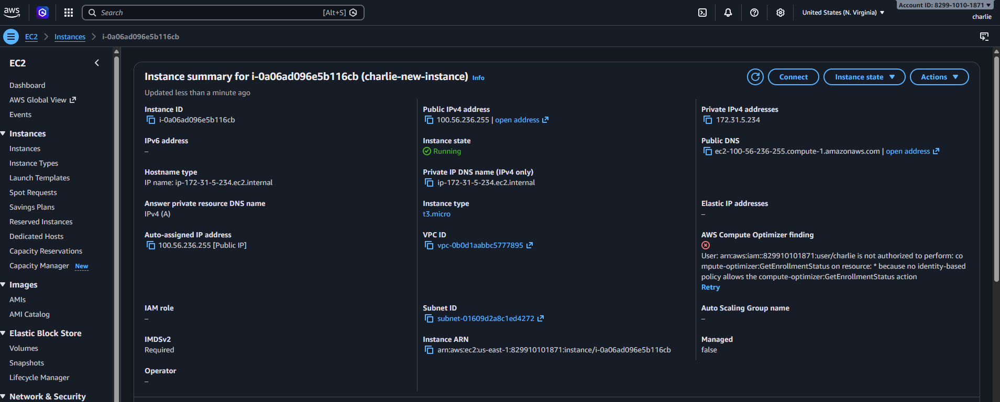
- S3 create bucket: ✅ SUCCESS
- EC2 launch instance: ✅ SUCCESS

### Summary of Test Results:

| User | S3 Full | EC2 View | EC2 Launch | Result |
|------|---------|----------|------------|--------|
| alice | ✅ | ✅ | ❌ | As expected |
| bob | ✅ | ✅ | ❌ | As expected |
| charlie | ✅ | ✅ | ✅ | As expected |

---

## Exercise 5: Custom Policy

### Policy JSON:
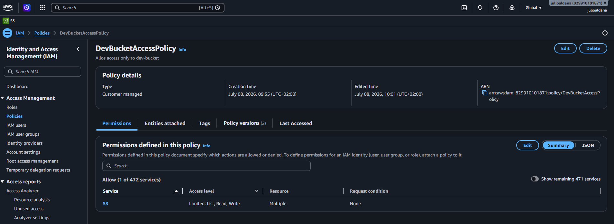

```json
{
    "Version": "2012-10-17",
    "Statement": [
        {
            "Sid": "ListAllBuckets",
            "Effect": "Allow",
            "Action": "s3:ListAllMyBuckets",
            "Resource": "*"
        },
        {
            "Sid": "DevBucketAccess",
            "Effect": "Allow",
            "Action": [
                "s3:ListBucket",
                "s3:GetObject",
                "s3:PutObject",
                "s3:DeleteObject"
            ],
            "Resource": [
                "arn:aws:s3:::dev-bucket-julio2026",
                "arn:aws:s3:::dev-bucket-julio2026/*"
            ]
        }
    ]
}
```

### Custom Policy Test:
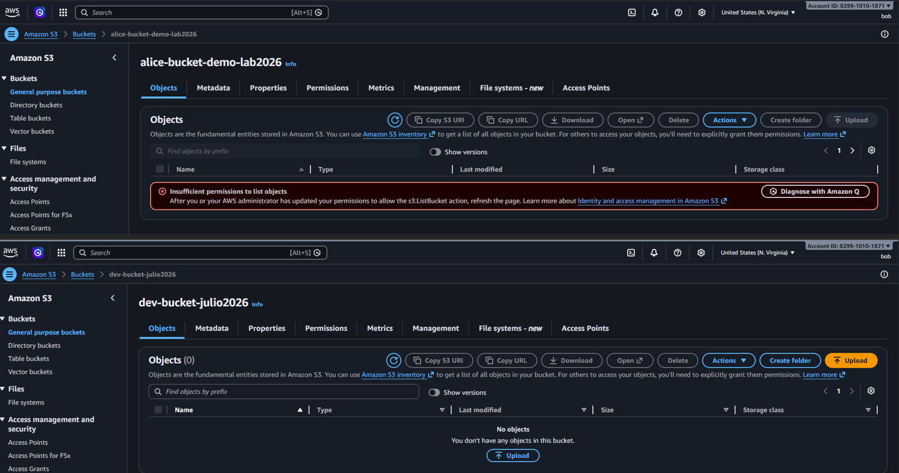

**Bob's Access After Custom Policy:**
- Access dev-bucket: ✅ SUCCESS
- Access other buckets: ❌ DENIED (Expected)

---

## Exercise 6: MFA Configuration

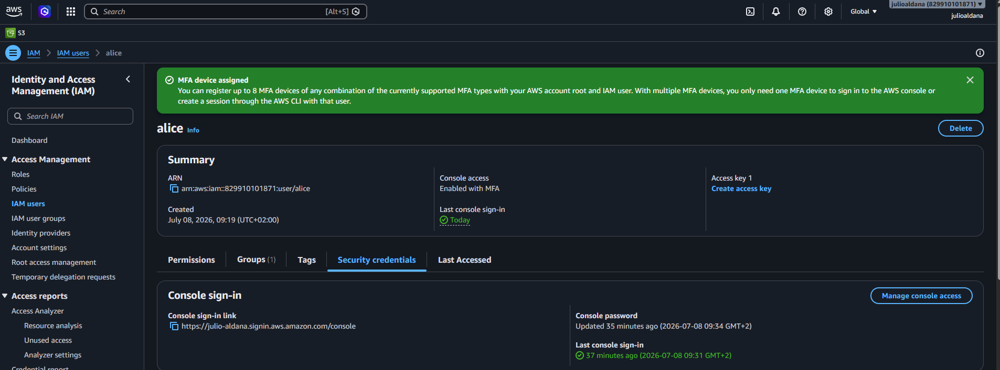

**MFA Details:**
- User: alice
- Device type: Virtual MFA
- Authenticator app: Microsoft Authenticator
- Status: ✅ Active

---

## Bonus Challenges

### Challenge 1: Password Policy


**Policy Settings:**
- [x] Minimum length: 12 characters
- [x] Require uppercase letters
- [x] Require lowercase letters
- [x] Require numbers
- [x] Require symbols
- [x] Password expiration: 90 days

---

### Challenge 2: Access Analyzer


**Findings:**
- Number of findings: [X]
- Critical issues: [List any public access found]
- Recommendations: [Your notes]

---

### Challenge 3: CLI Access Keys

**Alice Access Key Created:** [Yes / No]

**CLI Test Output:**
```bash
$ aws s3 ls --profile alice
[Paste output here]
```

**Screenshot:** [If applicable]

---

## Reflection Questions

### 1. Why use groups instead of attaching policies directly to users?

**Your Answer:**

For some functions, it is required for many users to have the same policies, as their roles in the project are similar. That is why groups help to maintain permissions in a faster and easier way.

---

### 2. What are the risks of giving everyone AdministratorAccess?

**Your Answer:**

The possibility of unexpected changes in security aspects increase if you don't control admin access. 

---

### 3. How would you organize IAM for 50 developers across 5 projects?

**Your Answer:**

I would assign a role and register on which projects each developer is working on. 
Then I would analyse the project, which features are needed and based on the roles I would create groups and assign the users to them. 
Tags would also help to locate the users in their respective projects. 

---

### 4. What happens if you delete an IAM user? Can you recover their permissions?

**Your Answer:**

No, deletion of a user is permanent. The only alternative is to create a new one and assign the corresponding permissions. 

---

## Key Learnings

**What was most challenging about this lab?**

Create the new policy for the bucket created. 

---

**What IAM best practice will you always follow?**

Change password frequently and store passwords in a safe place. 

---

**How does IAM help implement the principle of least privilege?**

By assigning only the sufficient permissions to the users to avoid unexpected access and reduce security risks. 

---

## Checklist

- [X] All 3 users created (alice, bob, charlie)
- [X] Both groups created (Developers, DevOps)
- [X] Permissions tested for each user
- [X] Custom policy created and tested
- [X] MFA enabled for at least one user
- [X] All screenshots captured
- [X] All reflection questions answered
- [X] Policy JSON file saved
- [X] Work committed to Git
- [X] Pull request created

---

**Completed By:** Julio Cesar Aldana Almanza  
**Date:** 07/08/2026
